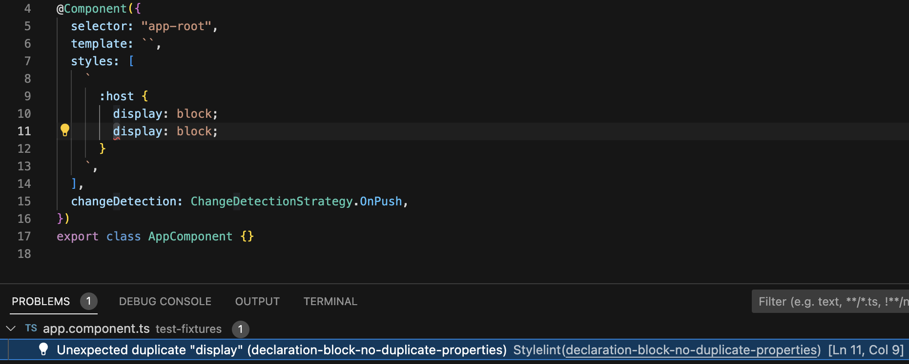

# postcss-angular

A [PostCSS](https://github.com/postcss/postcss) syntax for angular components using inline styles. Includes a [stringifier](https://github.com/postcss/postcss/blob/main/docs/syntax.md#stringifier) and a [parser](https://github.com/postcss/postcss/blob/main/docs/syntax.md#parser).

## Getting Started

Install postcss-angular as a dev dependency:
```bash
npm install -D postcss-angular
```
or
```bash
yarn add -D postcss-angular
```

### Usage with Stylelint

Add an override for `postcss-angular` to your `.stylelintrc.json`:

```JSON
{
  "extends": "stylelint-config-standard",
  "overrides": [
    {
      "files": ["**/*.component.ts"],
      "customSyntax": "postcss-angular"
    }
  ]
}
```

## vscode-stylelint

To make postcss-angular work with stylelint in VSCode, you need to enable TypeScript validation in your settings.json:

`"stylelint.validate": ["scss", "typescript"]`

You can use [vscode-stylelint](https://marketplace.visualstudio.com/items?itemName=stylelint.vscode-stylelint) to display errors and to fix auto-fixable problems.


